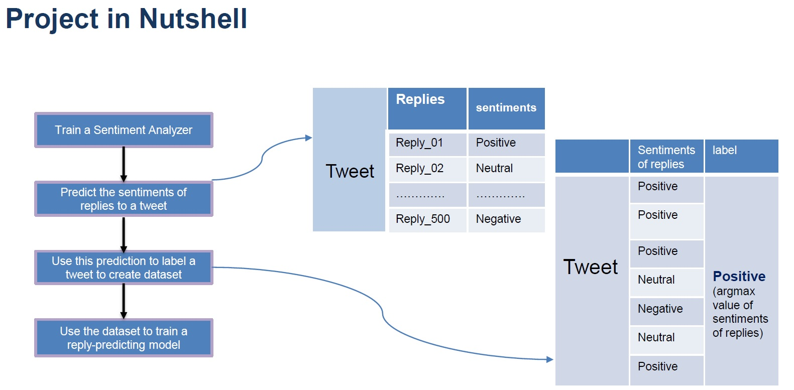

# Sentiment Analysis of Tweets and their Potential Replies

### By Soroosh Tayebi Arasteh & Mehrpad Monajem

This is the final project of the `Seminar Deep Learning` course (WS1920) jointly offered by the [Pattern Recognition Lab (LME)](https://lme.tf.fau.de/) of the *Computer Science Department*, and 
the [Chair of Computational Corpus Linguistics](https://www.linguistik.phil.fau.de/) of the *Department of German Language and Literature* at University of Erlangen-Nuremberg (FAU).


The main function running the training, testing and validation process is `main.py`.

Introduction
------
*What is Sentiment Analysis?* It is a machine learning technique that automatically analyses and detects the sentiment of text.
Here we do *Message-level* sentiment analysis, i.e. we classify the sentiment of the whole given message (tweet or reply).
### Goal of this project 
The aim of this project is to build a sentiment classification tool which, given a tweet predicts how likely it gets positive, negative or neutral replies. In other words, it is a tool to predict the nature of replies to a tweet is most likely to get.
## Getting Started

### Prerequisites

The software is developed in **Python 3.7**. For the deep learning, the **PyTorch 1.3.1** (including *TorchText 0.5.0*) framework is used.


Main Python modules required for the software can be installed from ./requirements in three stages:

1. Create a Python3 environment by installing the conda `environment.yml` file:

```
$ conda env create -f environment.yml
$ activate SentimentAnalysis
```


2. Install the remaining dependencies from `requirements.txt`.

***Note:*** These might take a few minutes.

3. We have also made use of **spaCy** to tokenize our data. To install spaCy, follow the instructions [here](https://spacy.io/usage) making sure to install the English models with:

```
$ python -m spacy download en
```


Approach to the challange
------

This project can be divided into two consecutive parts to reach our goal.
1. Creating a Sentiment Classifying tool for tweets
2. Sentiment Predictor for Tweet-Replies



Part 1: Sentiment Analysis of the labeled tweets
------
- Supervised deep learning method.
- Message-level Sentiment Analysis of tweets, based on the Subtask B of Task 10 of the SemEval 2015 challenge.
- Preliminary goal: To beat the state-of-the-art of the corresponding task of the SemEval.
- Final goal: To tackle the unsupervised nature of the part 2 of the project as supervised.
 
#### Model Architecture
A modified version of Bi-directional Long-Short Term Memory Units (BiLSTM).
#### Training Parameters

| Name        | Value           |
| :-------------: |:-------------:| 
| Number of trainable parameters    | 4,811,883
| Training duration | 57 minutes and 08 seconds on Nvidia GeForce 940MX
| Number of epochs | 60 
| Embedding | GloVe with 100 dimensions pre-trained on 6 billion data
| Loss function    | Cross Entropy Loss   
| Optimizer        | Adam with a learning rate of 5e-5 with a decay of 1e-5
| Hidden and cell dimensions of the LSTM  | 256    

#### Testing Results on the gold test data of SemEval 2014 combined with 2015

| Name        | Value           |
| :-------------: |:-------------:| 
| Accuracy    | 73.57%
| F1-score | 0.721 (the [state-of-the-art](https://www.aclweb.org/anthology/S17-2094/) is 0.685)

Part 2: Sentiment Analysis of the Unlabeled Tweet-Replies
------
- Originally Unsupervised problem.
- Idea: To leverage the model in the part 1, to tackle the unsupervised nature of the problem.
 
#### Strategy

1. Extract tweets from Twitter with their corresponding replies.
2. If a tweet has multiple replies, regard each reply as a separate data and repeat the
tweet.
3. First ignore the tweets and predict the sentiment of each reply using the model from the
part 1.
4. For the replies corresponding to the same tweet, choose the label which has the
maximum occurance and assign it as the tweet‘s label and then ignore the replies.
5. Now we have a training set of some tweets with their labels, SUPERVISED!
6. Train another model with this data.
7. Now the final model is ready. Given only tweets as the input, this model predicts the
sentiment of the potential reply that tweet is likely to get!
